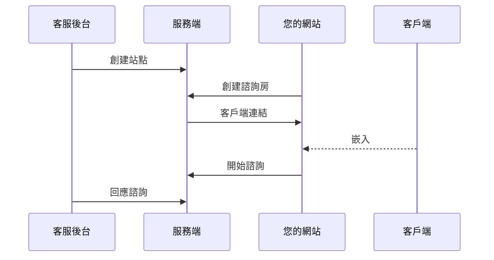

# 🌿 BasilCS 客服系統

Digital Ocean 折扣碼連結  
https://m.do.co/c/5cea3707b649

開箱即用，架構上選擇前後端分離，便於團隊二次開發  
主要技術棧為 Golang + Vue + MySQL + Redis  
整套系統總共分為三個子系統：
- cs-api 客服系統服務端
- cs-web-cms 客服後台管理系統
- cs-web-chat 客服客戶端諮詢頁面

## 項目特點
- 基於 uber fx DI 框架開發
- 基於 cobra 開發 CLI 互動介面
- 基於 viper 管理配置參數
- 基於 websocket 的聊天通信
- 後端支援動態擴容
- 數據庫交互方面透過 sqlc 編譯，單元測試時便於替換自定義 mock 方法
- 後端開發架構上根據業務模組做拆分，如：./cs-api/pkg/module

## 功能列表
- 客服諮詢面板
- 職員管理
- 權限管理
- 會員管理
- 多站點管理
- 常見問題管理
- 快捷回覆管理
- 諮詢房標籤管理
- 報表管理
- 歷史紀錄查詢
- 後台提醒管理
- 系統公告管理

## 如何使用
### 接入客戶端流程圖


### 本地部署
為了方便快速啟動，可以參考 ./docker 目錄，提供該項目會使用到的工具，可再依據需求自行擴充。

#### 範例步驟：
1. 域名添加
```shell
# 進入 hosts 檔案
sudo vim /etc/hosts
# 添加以下域名
127.0.0.1 chat.local.cs.com cms.local.cs.com static.local.cs.com
```
2. 編譯前端  
- 客服後台 (cs-web-cms)
```shell
# 切換目錄
cd cs-web-cms
# 新增 .env 檔案
cp .env.example .env
# 安裝依賴
yarn
# 編譯
yarn build
```
- 客服客戶端 (cs-web-chat)
```shell
# 切換目錄
cd cs-web-chat
# 新增 .env 檔案
cp .env.example .env
# 安裝依賴
yarn
# 編譯
yarn build
```
2. 啟動容器
```shell
# 切換到 docker 目錄下面
cd docker
# 啟動容器
docker-compose up -d
```
3. 啟動客服服務端 (cs-api)
```shell
# 切換目錄
cd cs-api
# 啟動 server 預設 port 8082
make server
```
完成以上步驟就可以開啟 http://cms.local.cs.com 查看畫面了  
登入帳號和密碼都是 admin，密碼能夠在 ./cs-api/config/config.yaml#admin_password 中自行設定

4. 開起客戶端聊天頁面  
   1. 需要先至客服後台 [站點管理] 中新增一個站點
   2. 呼叫 POST http://localhost:8082/room 創建諮詢房，獲取客戶端連結，即可訪問。請求參數範例如下：
```json
{
    "code": "test",
    "source": 1,
    "name": "andy"
}
```
### 容器化部署
在各個子系統下提供 dockerfile 以及 ./deploy 目錄供您參考使用，便於快速進行容器化部署至 kubernetes 或者是 serverless 應用中，例如 GCP Cloud Run

## 常見問題
| 問題            | 答案                                                                     |
|---------------|------------------------------------------------------------------------|
| websocket 連不上 | 檢查是否沒有將 Origin 添加進白名單 ./cs-api/config/config.yaml#ws_origin_white_list |